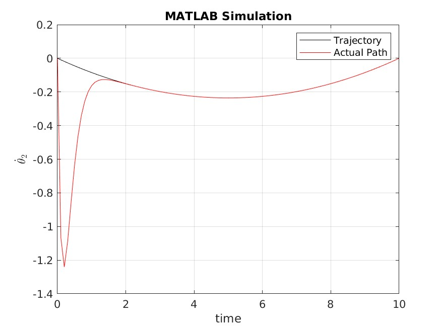

**Trajectory Tracking using State Feedback Linearization Control for a 2 DoF RRBot**

<!-- TOC -->

- [About](#about)
- [How to Design State Feedback Linearization Controller](#how-to-design-state-feedback-linearization-controller)
    - [Calculate the Equation of Motion](#calculate-the-equation-of-motion)
    - [Design State Feedback Linearization Controller](#design-state-feedback-linearization-controller)
- [Results](#results)
    - [MATLAB](#matlab)
    - [Gazebo and ROS](#gazebo-and-ros)
- [Performance Comparision](#performance-comparision)
- [Observations and Results](#observations-and-results)
- [Designer Details](#designer-details)
- [License](#license)

<!-- /TOC -->

# About

The assignment aims to design State Feedback Linearization Controller for a 2-DoF Revolute Revolute Arm for Trajectory Tracking.

The project uses the Equation of Motion derived in this [project](https://github.com/parth-20-07/2-DoF-Revolute-Revolute-robot-arm-Equation-of-Motion) for the identical RRBot.

The assignment aims to design a polynomial trajectory of 3rd order and design a controller based on state feedback  Linearization control for the RRBot using Virtual Control. The controller is of the form:

$$
v_{i} = - K(x - x_{d}) + v_{d}
$$

where;

- $v_{i}$ is the virtual input for the joint
- $x_{d}$ is the desired position at any instance of time
- $v_{d}$ is the desired acceleration at any instance of time which is calculated by taking the double derivative of the position equation

# How to Design State Feedback Linearization Controller

## Calculate the Equation of Motion

Calculate the equation of motion for the system using the guide [here](https://github.com/parth-20-07/2-DoF-Revolute-Revolute-robot-arm-Equation-of-Motion).

## Design State Feedback Linearization Controller

- Design the controller of form:
  $$
  \begin{equation}\notag
  \begin{bmatrix}
  u_{1}\\u_{2}
  \end{bmatrix}

  =

  \begin{bmatrix}
  \ddot{\theta_{1}}\\\ddot{\theta_{2}}
  \end{bmatrix}

  \end{equation}
  $$

- Replace $\ddot{\theta_{i}}$ with virtual input $v_{i}$ for trajectory tracking controller design.

# Results

## MATLAB
The complete calculation has been done [here (webpage form)](https://htmlpreview.github.io/?https://github.com/parth-20-07/Trajectory-Tracking-using-State-Feedback-Linearization-Control-for-a-2-DoF-RRBot/blob/main/Solution/MATLAB/main.html) in MATLAB. The systems with the equation of motion are simulated as follows

## Gazebo and ROS

The same system is simulated with the equations of motion present in Gazebo with real-world physics replication as shown [here (webpage form)](https://htmlpreview.github.io/?https://github.com/parth-20-07/Trajectory-Tracking-using-State-Feedback-Linearization-Control-for-a-2-DoF-RRBot/blob/main/Solution/Gazebo/rrbot_traj_control.html).

# Performance Comparision

- **$\theta_{1}$ vs $t$**

  
  
- **$\dot{\theta_{1}}$ vs $t$**

  
  
- **$\tau_{1}$ vs $t$**

  

- **$\theta_{2}$ vs $t$**

  
  
- **$\dot{\theta_{2}}$ vs $t$**

  

# Observations and Results

| Graph Type                | MATLAB                                                | Gazebo                                                 |
| ------------------------- | ----------------------------------------------------- | ------------------------------------------------------ |
| $\theta_{1}$ vs $t$       |    |     |
| $\dot{\theta_{1}}$ vs $t$ |  |   |
| $\tau_{1}$ vs $t$         |        |         |
| $\theta_{2}$ vs $t$       |    |     |
| $\dot{\theta_{2}}$ vs $t$ |  |  |
| $\tau_{2}$ vs $t$         |        |         |

**Possible Reasons for difference:**
- The lack of friction in the MATLAB System.
- The estimated value of gravitational acceleration in MATLAB.

# Designer Details

- Designed for:
  - Worcester Polytechnic Institute
  - RBE502 - Robot Control
- Designed by:
  - [Parth Patel](mailto:parth.pmech@gmail.com)

# License

This project is licensed under [GNU General Public License v3.0](https://www.gnu.org/licenses/gpl-3.0.en.html) (see [LICENSE.md](LICENSE.md)).

Copyright 2023 Parth Patel

Licensed under the GNU General Public License, Version 3.0 (the "License"); you may not use this file except in compliance with the License.

You may obtain a copy of the License at

_https://www.gnu.org/licenses/gpl-3.0.en.html_

Unless required by applicable law or agreed to in writing, software distributed under the License is distributed on an "AS IS" BASIS, WITHOUT WARRANTIES OR CONDITIONS OF ANY KIND, either express or implied. See the License for the specific language governing permissions and limitations under the License.
